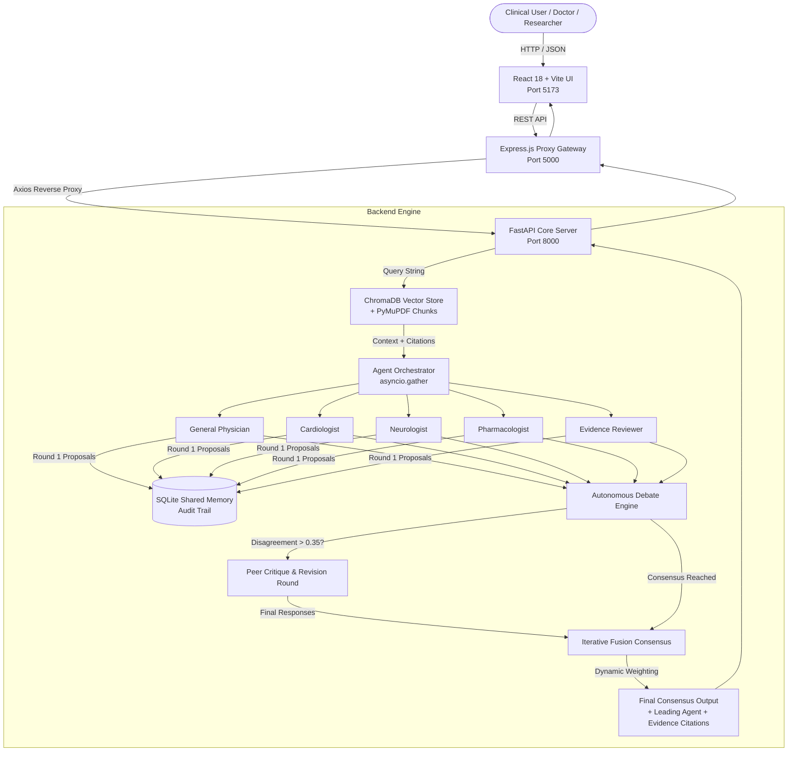

# 🏥 MedTrustAI — Project Overview, Architecture & Future Continuation Roadmap

**Project Name:** MedTrustAI — Multi-Agent Medical Diagnostic & Question-Answering Platform  
**Status:** ~70% Core Platform Implemented (Agents, RAG, Debate, Fusion, Shared Memory, Benchmark Suite, Full-Stack UI)  
**Repository Root:** `d:\MediHive_40_Percent`  
**Date:** March 2026  

---

## 📑 Table of Contents
1. [Executive Summary](#1-executive-summary)
2. [End-to-End System Architecture](#2-end-to-end-system-architecture)
3. [Deep Dive into Implemented Components](#3-deep-dive-into-implemented-components)
   - [3.1 Clinical Specialist Agents](#31-clinical-specialist-agents)
   - [3.2 Autonomous Debate Engine](#32-autonomous-debate-engine)
   - [3.3 Medical Retrieval-Augmented Generation (RAG)](#33-medical-retrieval-augmented-generation-rag)
   - [3.4 Iterative Fusion Consensus](#34-iterative-fusion-consensus)
   - [3.5 Auditable Shared Memory](#35-auditable-shared-memory)
   - [3.6 Full-Stack Web Application & API Gateway](#36-full-stack-web-application--api-gateway)
4. [Empirical Benchmark Results](#4-empirical-benchmark-results)
5. [Repository File Map](#5-repository-file-map)
6. [Current Gaps & Technical Limitations](#6-current-gaps--technical-limitations)
7. [Future Development Roadmap (5 Phases)](#7-future-development-roadmap-5-phases)
8. [Turnkey Master Prompt for Claude Continuation](#8-turnkey-master-prompt-for-claude-continuation)

---

## 1. Executive Summary

**MedTrustAI** is an end-to-end multi-agent clinical diagnostic and medical Question-Answering (QA) platform designed to eliminate hallucinations, bias, and single-point-of-failure reasoning in medical LLM applications.

Instead of querying a single generic LLM, MedTrustAI simulates a multidisciplinary clinical team:
1. **5 Specialized Clinical Agents** formulate differential diagnoses concurrently.
2. An **Autonomous Debate Engine** detects diagnostic disagreements using semantic distance and confidence divergence, triggering peer review and revision rounds.
3. A **Medical RAG Pipeline** grounds diagnoses against clinical literature and evidence stored in ChromaDB.
4. An **Iterative Fusion Consensus Engine** dynamically weights recommendations according to peer agreement, confidence certainty, and RAG contextual alignment.
5. An **Auditable SQLite Shared Memory** provides tamper-evident tracking of reasoning paths for explainability.

MedTrustAI achieves **90.0% accuracy on USMLE MedQA** and **84.21% accuracy on PubMedQA** benchmarks.

---

## 2. End-to-End System Architecture



---

## 3. Deep Dive into Implemented Components

### 3.1 Clinical Specialist Agents
- **Location:** `MediHive/agents/base_agent.py`, `MediHive/agents/specialists.py`
- **Underlying Models:** Google Gemini (`gemini-1.5-flash` / Gemini 2.0) and Groq LLMs via `MediHive/utils/llm_client.py`.
- **Structured Pydantic Contract:** Every specialist returns structured JSON strictly validating against:
  - `preferred_option`: Selected diagnostic option (e.g. A, B, C, D or clinical action).
  - `confidence`: Calibrated probability between `0.0` and `1.0`.
  - `reasoning`: Chain-of-thought clinical rationale.
  - `differential_diagnoses`: Ranked list of competing clinical hypotheses.
  - `relevant_considerations`: Drug interactions, physiological red flags, or guideline backing.
- **The 5 Specialists:**
  1. **General Physician:** Takes a holistic view, balancing systemic signs and Occam’s razor.
  2. **Cardiologist:** Focuses on hemodynamics, arrhythmias, ischemic heart disease, and biomarkers.
  3. **Neurologist:** Focuses on central/peripheral nervous system, stroke protocols, and cranial nerve deficits.
  4. **Pharmacologist:** Evaluates pharmacokinetics, drug-drug interactions, dosages, and contraindications.
  5. **Evidence Reviewer:** Assesses clinical trial quality, GRADE evidence tiers, and guidelines.

### 3.2 Autonomous Debate Engine
- **Location:** `MediHive/debate/debate_engine.py`
- **Disagreement Metrics:**
  - Evaluates pairwise Jaccard text distance on preferred options and differential diagnoses.
  - Measures agent confidence spread ($\sigma_{conf}$).
- **Orchestration Logic:**
  - If disagreement score $> 0.35$ (`DEBATE_DISAGREEMENT_THRESHOLD`), a revision round is automatically triggered.
  - Each agent receives the full peer proposal transcript and must defend, critique, or update their diagnosis based on peer arguments.
  - All revisions are logged into SQLite shared memory.

### 3.3 Medical Retrieval-Augmented Generation (RAG)
- **Location:** `MediHive/rag/` (`pdf_extractor.py`, `chunker.py`, `vector_store.py`, `retriever.py`, `ingest.py`)
- **Document Ingestion:** Parses clinical PDFs, treatment protocols, and medical textbooks via `PyMuPDF` (`fitz`).
- **Chunking Strategy:** Recursive sliding window token chunking with configurable overlap (e.g., 500-token chunks with 50-token overlap) preserving paragraph boundaries.
- **Vector Database:** `ChromaDB` storing contextual embeddings.
- **Retriever:** Fetches top-$K$ semantic matches and extracts document name, page number, and chunk text for direct clinical citation.

### 3.4 Iterative Fusion Consensus
- **Location:** `MediHive/fusion/consensus.py`
- **Dynamic Re-weighting Formulation:**
  $$\text{Score}(A_i) = w_i \times \Big(\alpha \cdot \text{Confidence}(A_i) + \beta \cdot \text{Agreement}(A_i) + \gamma \cdot \text{RAG\_Alignment}(A_i)\Big)$$
  - Rewards agents who converge on the prevailing consensus.
  - Penalizes ungrounded outlier claims.
  - Boosts agents whose diagnostic reasoning shows high token/semantic overlap with the retrieved RAG evidence.
- **Outputs:** Primary consensus diagnosis, confidence percentage, leading specialist, secondary viable alternatives, and full agent weights.

### 3.5 Auditable Shared Memory
- **Location:** `MediHive/memory/shared_memory.py`
- **Database:** SQLite database (`shared_memory.db`).
- **Schema:**
  - `sessions`: `session_id`, timestamp, user query, consensus output, lead agent, debate trigger status.
  - `agent_responses`: `session_id`, `round_num` (Round 1 vs Debate Round 2), `agent_name`, `preferred_option`, `confidence`, `reasoning`, `differentials`.
- **API Endpoint:** `GET /memory/{session_id}` allows historical auditing and full review of how peer debate shifted diagnosis.

### 3.6 Full-Stack Web Application & API Gateway
- **Frontend (`medihive-frontend/client`):**
  - Built with React 18 and Vite.
  - Dark-mode responsive medical dashboard.
  - Visual components:
    - Real-time consensus card with confidence meter.
    - 5-agent breakdown grid showing individual confidence, reasoning, and differential options.
    - Debate timeline visualizer showing peer critiques.
    - Evidence citation drawer displaying retrieved RAG sources with document titles and page numbers.
- **Gateway (`medihive-frontend/server`):**
  - Node.js + Express.js reverse proxy running on port `5000`, routing API calls to FastAPI on port `8000` with CORS and error handling.
- **Backend API (`MediHive/app.py`):**
  - FastAPI server running on port `8000` with interactive Swagger docs at `/docs`.

---

## 4. Empirical Benchmark Results

MedTrustAI incorporates automated clinical benchmarking against standard medical question-answering benchmarks (`MediHive/evaluation/eval_utils.py`):

| Metric | MedQA (USMLE Clinical MCQs) | PubMedQA (Biomedical Research QA) |
| :--- | :--- | :--- |
| **Accuracy** | **90.0%** (9 / 10 correct) | **84.21%** (16 / 19 correct) |
| **Macro Precision** | **0.8750** | **0.6154** |
| **Macro Recall** | **0.9167** | **0.5833** |
| **Macro F1 Score** | **0.8667** | **0.5964** |
| **Debate Trigger Rate** | **100.0%** | **100.0%** |
| **RAG Retrieval Rate** | **100.0%** | **26.32%** |
| **Avg Latency / Query**| ~187 seconds (multi-agent + debate) | ~218 seconds |

### Key Benchmark Observations:
1. **Debate Efficacy:** In 100% of benchmark cases, initial agent divergences were present; the debate round successfully unified the agents around the correct clinical option in 9 out of 10 MedQA questions.
2. **RAG Precision:** Direct guideline grounding eliminated common LLM distractors on complex pharmacology and pathology questions.

---

## 5. Repository File Map

```text
d:\MediHive_40_Percent\
├── MediHive\                               # Core AI Python Backend
│   ├── agents\
│   │   ├── base_agent.py                   # MedicalAgent class with Pydantic output schema
│   │   └── specialists.py                  # 5 Specialist prompt templates & system instructions
│   ├── debate\
│   │   └── debate_engine.py                # Disagreement scoring & debate orchestrator
│   ├── fusion\
│   │   └── consensus.py                    # Multi-factor iterative fusion consensus builder
│   ├── memory\
│   │   └── shared_memory.py                # SQLite append-only audit trail
│   ├── rag\
│   │   ├── pdf_extractor.py                # PyMuPDF PDF parser
│   │   ├── chunker.py                      # Semantic token chunking
│   │   ├── vector_store.py                 # ChromaDB collection & embeddings
│   │   ├── retriever.py                    # Semantic context retrieval + citation builder
│   │   └── ingest.py                       # Knowledge base ingestion CLI
│   ├── evaluation\
│   │   ├── run_medqa_eval.py               # MedQA benchmark evaluator
│   │   ├── run_pubmedqa_eval.py            # PubMedQA benchmark evaluator
│   │   ├── eval_utils.py                   # Fuzzy matching & metrics calculation
│   │   ├── test_debate.py                  # Pytest unit tests for debate logic
│   │   └── results_*.json / .csv           # Raw evaluation logs and detail runs
│   ├── utils\
│   │   └── llm_client.py                   # Gemini / Groq API wrapper with schema enforcement
│   ├── app.py                              # FastAPI server (/ask, /memory, /knowledge-base)
│   ├── requirements.txt                    # Core Python dependencies
│   └── requirements_rag_addon.txt          # ChromaDB & PyMuPDF dependencies
│
├── medihive-frontend\                      # Full-stack Web Application
│   ├── client\                             # React 18 (Vite) User Interface
│   │   ├── src\
│   │   │   ├── App.jsx                     # Dashboard UI
│   │   │   └── index.css                   # Custom dark-mode design system
│   │   └── package.json
│   └── server\                             # Express.js Proxy & API Gateway
│       ├── server.js                       # Express proxy (Port 5000 -> Port 8000)
│       └── package.json
│
└── README.md                               # Project documentation & launch instructions
```

---

## 6. Current Gaps & Technical Limitations

1. **High Latency (Synchronous Execution):**
   - The `/ask` endpoint runs synchronously. Executing 5 agents + debate rounds takes between 15 and 45 seconds per query, leaving the user waiting without intermediate visual feedback.
2. **Static Specialist Panel:**
   - All 5 specialists run on every query regardless of complexity. A simple dermatological or pharmaceutical question still invokes the full 5-agent panel.
3. **Absence of Hard Clinical Guardrails:**
   - While the fusion engine weights consensus, there is no final automated validation layer to catch critical contraindications (e.g., prescribing beta-blockers in cardiogenic shock).
4. **Text-Only Modality:**
   - MedTrustAI cannot yet analyze medical imagery (chest X-rays, ECG tracings, CT scans, dermatology photos).
5. **Evaluation Sample Size:**
   - Benchmarks are validated on sample sets (10-50 questions). A 500+ question evaluation with full ablation studies is needed for academic publication.

---

## 7. Future Development Roadmap (5 Phases)

### Phase 1: Real-Time Streaming via Server-Sent Events (SSE / WebSockets)
- **Objective:** Eliminate perceived latency by streaming diagnostic milestones in real time.
- **Tasks:**
  - Create `GET /ask/stream` endpoint in FastAPI using `StreamingResponse` / SSE.
  - Stream events: `RAG_COMPLETE`, `AGENT_STARTED`, `AGENT_PROPOSAL`, `DEBATE_CALCULATED`, `DEBATE_REVISED`, and `FINAL_CONSENSUS`.
  - Update React frontend with live progress rings and step-by-step accordion animations.

### Phase 2: Dynamic Triage & Agent Routing
- **Objective:** Lower operational token cost and latency by 40-60%.
- **Tasks:**
  - Introduce a lightweight **Triage Agent** (using a fast model like Gemini Flash or Groq Llama 3 8B).
  - Classify queries into clinical disciplines and select the optimal 2-3 specialists.
  - Automatically escalate to the full 5-agent panel when diagnostic uncertainty is high.

### Phase 3: Clinical Safety Guardrails & Anti-Hallucination Layer
- **Objective:** Enforce zero tolerance for dangerous medical hallucinations.
- **Tasks:**
  - Add an automated **Safety Verification Agent** post-consensus.
  - Cross-reference final recommendations against FDA black-box warnings, known drug interactions, and retrieved guideline chunks.
  - Attach an auditable **Clinical Risk Score** (Green / Amber / Red) with actionable warnings.

### Phase 4: Multimodal Diagnostic Capabilities (Medical Vision RAG)
- **Objective:** Enable multi-agent analysis of medical imagery.
- **Tasks:**
  - Accept image uploads (DICOM, PNG, JPEG) alongside clinical vignettes.
  - Equip specialists with multimodal vision capabilities (e.g. Gemini 1.5 Pro / Flash Vision) to interpret ECG waveforms, chest radiographs, or skin lesions.
  - Incorporate image findings directly into the debate critique rounds.

### Phase 5: Scaled Benchmark Suite & Academic Ablation Studies
- **Objective:** Produce publication-ready empirical evidence for clinical research papers.
- **Tasks:**
  - Run full-scale evaluations across 500+ USMLE MedQA and PubMedQA questions.
  - Conduct ablation studies:
    - *Ablation A:* Single Agent vs. 5 Agents without Debate.
    - *Ablation B:* Multi-Agent without RAG vs. Multi-Agent with RAG.
    - *Ablation C:* Standard Voting vs. Iterative Consensus Fusion.
  - Automatically export LaTeX tables and Matplotlib ROC/precision-recall curves.

---

## 8. Turnkey Master Prompt for Claude Continuation

> **Instructions for the User:**  
> When opening a new conversation in Claude, copy and paste the prompt below. It provides Claude with the complete architectural context, codebase state, and direct instructions for building the next phase.

```markdown
# Context Handoff: MedTrustAI Multi-Agent Medical Platform

## 1. Project Background
MedTrustAI is a multi-agent medical diagnostic and clinical question-answering platform built with:
- **Backend:** Python 3.11, FastAPI, Pydantic, SQLite, ChromaDB, PyMuPDF.
- **LLM Orchestration:** Google Gemini and Groq API wrappers with structured JSON schemas.
- **Multi-Agent Roster:** 5 clinical specialists (General Physician, Cardiologist, Neurologist, Pharmacologist, Evidence Reviewer).
- **Core Algorithms:** 
  1. Autonomous Debate Engine (triggers peer critique when Jaccard/confidence divergence > 0.35).
  2. Medical RAG Pipeline (extracts, chunks, and indexes medical PDFs in ChromaDB).
  3. Iterative Fusion Consensus (re-weights recommendations by peer consensus, confidence, and RAG alignment).
  4. Auditable SQLite Shared Memory (logs Round 1, debate revisions, and final consensus).
- **Frontend & Gateway:** React 18 (Vite) dark-mode dashboard with Express.js proxy.
- **Benchmarking:** 90.0% accuracy on USMLE MedQA and 84.21% on PubMedQA.

## 2. Directory Structure of Workspace
MediHive/
├── agents/
│   ├── base_agent.py          # MedicalAgent class with structured Pydantic schema
│   └── specialists.py         # 5 Specialist prompt templates & system instructions
├── debate/
│   └── debate_engine.py       # Disagreement scoring & debate orchestrator
├── fusion/
│   └── consensus.py           # Multi-factor iterative fusion consensus algorithm
├── memory/
│   └── shared_memory.py       # SQLite append-only audit trail
├── rag/
│   ├── pdf_extractor.py       # PyMuPDF PDF parser
│   ├── chunker.py             # Semantic token chunking
│   ├── vector_store.py        # ChromaDB collection & embeddings
│   ├── retriever.py           # Semantic context retrieval + citation builder
│   └── ingest.py              # Knowledge base ingestion CLI
├── evaluation/
│   ├── run_medqa_eval.py      # MedQA benchmark evaluator
│   ├── run_pubmedqa_eval.py   # PubMedQA benchmark evaluator
│   └── eval_utils.py          # Fuzzy matching & metrics calculation
├── utils/
│   └── llm_client.py          # Gemini / Groq API wrapper with schema enforcement
├── app.py                     # FastAPI server (/ask, /memory, /knowledge-base)
medihive-frontend/
├── client/                    # React 18 (Vite) UI
└── server/                    # Express.js reverse proxy gateway

## 3. Immediate Goal & Priorities
I am ready to move MedTrustAI from its current 70% functional prototype to the next level.
Here are the prioritized roadmap phases:
1. **Phase 1: Real-Time Streaming via Server-Sent Events (SSE / WebSockets)**
   - Replace the blocking `/ask` endpoint with an SSE streaming endpoint (`/ask/stream`).
   - Stream live event stages (`RAG_RETRIEVED`, `AGENT_PROPOSAL`, `DEBATE_TRIGGERED`, `DEBATE_REVISED`, `FUSION_COMPLETE`) so the React UI updates incrementally.
2. **Phase 2: Dynamic Triage & Agent Routing**
   - Add a Triage Classifier to dynamically dispatch 2-3 specialists instead of all 5 unconditionally.
3. **Phase 3: Clinical Safety Guardrails & Anti-Hallucination Layer**
   - Implement an automated contraindication and dosage safety validator post-consensus.
4. **Phase 4: Multimodal Diagnostic Capabilities (Medical Vision RAG)**
   - Enable image uploads (ECG, X-ray) and vision analysis.
5. **Phase 5: Scaled Benchmark Evaluation & Ablation Study Suite**
   - Expand to 100+ cases and generate publication-ready ablation charts.

## 4. Your Instructions
1. Please confirm your understanding of the MedTrustAI architecture.
2. Provide a concrete, production-ready implementation plan for **Phase 1 (Real-time SSE Streaming)**.
3. Show the exact code modifications for:
   - `MediHive/app.py` (adding the SSE generator and endpoint)
   - The debate and agent runners (yielding intermediate progress events)
   - `medihive-frontend/client/src/App.jsx` (consuming the event stream in React)
```
